###### *Desarrollo Web en Entorno Servidor - Curso 2017/2018 - IES Leonardo Da Vinci - Alberto Ruiz*
## U0P04 - Eclipse y Git
#### Entrega de: *pon aquí tu nombre*
----

#### 1. Descripción:

Plataformas como GitHub y GitLab almacenan en *la nube* repositorios de proyectos, de forma que personas de todo el mundo pueden colaborar en ellos. Ya tenemos nuestra cuenta en GitHub, pero ahora configuraremos GitHub para su uso desde Eclipse mediante el plugin Egit, y probaremos su funcionamiento. Finalmente repetiremos el proceso con GitLab, comprobando que no hay diferencias de funcionamiento entre ambas implementaciones.

#### 2. Formato de entrega:

Iremos incluyendo capturas de pantalla en este documento para ilustrar los diferentes pasos. Decide en qué puntos es interesante incluir captura: si dudas, es mejor que la incluyas. Puedes incluir también notas, comentarios o problemas que vayas encontrando: este documento se convertirá así en tu propio tutorial para configurar GitHub y GitLab.

#### 3. Trabajo a realizar:

Antes de comenzar debes asegurarte de que tienes ya tu proyecto *U0P02-Java-Control de flujo*. A lo largo de la práctica vamos a:
   * Subir ese proyecto al repositorio
   * Descargarlo del repositorio en una maquina diferente
   * Estudiar cómo podemos mantener la versión más actual del proyecto en las dos máquinas

##### Parte 1. Creación o reutilización del repositorio

Durante el curso vamos a trabajar con un repositorio llamado **dwesXX-github**, donde XX sea tu número de equipo. Tienes dos posibilidades: renombrar el utilizado en la práctica anterior, o eliminarlo y comenzar de cero.

1. Accede a tu repositorio.  Comprueba que sólo el usuario que creó el repositorio tiene una pestaña accesible llamada `Settings`
  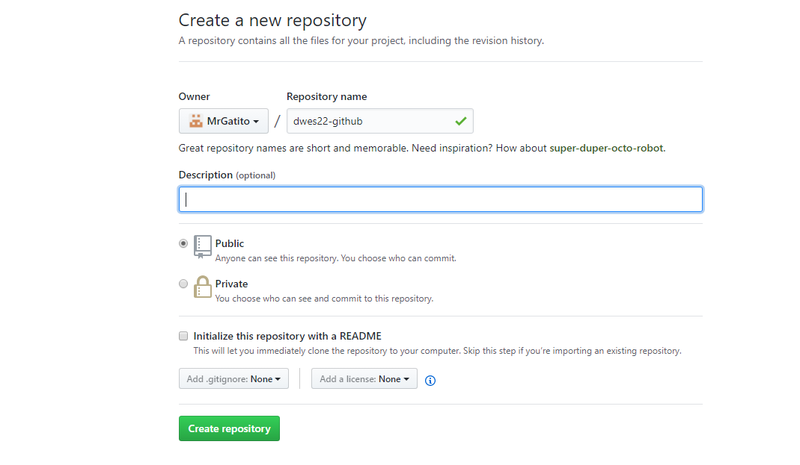

2. En esa pestaña, en la parte inferior, están las opciones para renombrar o eliminar un repositorio
##### Parte 2. Configuración de GitHub en Eclipse

Vamos a configurar nuestra máquina para trabajar con un repositorio remoto. Más allá de lo que hagamos en esta práctica, puedes encontrar toda la información sobre la interacción de Git y Eclipse [en este tutorial](http://www.vogella.com/tutorials/EclipseGit/article.html#github).

1. Dentro de Eclipse, accede a *Eclipse → Help → Install new software*


1. En el campo *Work with* escribe esta dirección y pulsa Intro: http://download.eclipse.org/egit/updates/
2. Instala *Eclipse Git Team Provider* y *Java implementation of Git*

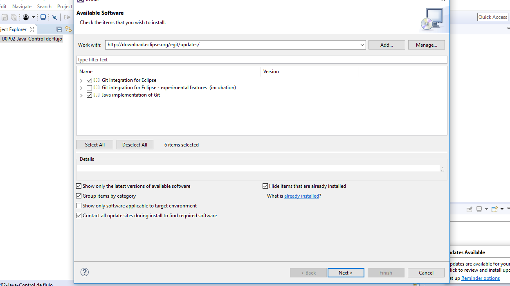

- Ahora crea en tu equipo una carpeta para los repositorios. Debe ser diferente de tu carpeta *workspace*. Ejemplo: `C:\Users\alumno\git`
- En Eclipse, accede a a *Windows → Preferences → Team → Git* y escoge la carpeta que acabas de crear como carpeta de repositorios.


- Para configurar el acceso seguro al repositorio es imprescindible generar una clave SSH compartida por nuestro equipo y la web de GitHub. Para generarla: *Window → Preferences → General → Network Connection → SSH2 → Key Management → Generate DSA Key*
- Una vez generada debes hacer dos cosas:
    - Guardarla (*Save Private Key*) en la carpeta local de repositorios que escogiste antes
    - Copiarla al portapapeles (*clic secundario → seleccionar todo → copiar*)
- Accede ahora a tu perfil en la web de GitHub a través del icono en la parte superior derecha (*Your profile*).
- Accede a *Edit Profile → SSH and GPG Keys → New SSH Key*. Ponle un título que identifique a este ordenador (por ejemplo tu nombre de equipo seguido de IES Leonardo) y pega la clave que has copiado previamente en el portapapeles. Ahora tu equipo podrá conectarse a tu cuenta GitHub de forma segura. 

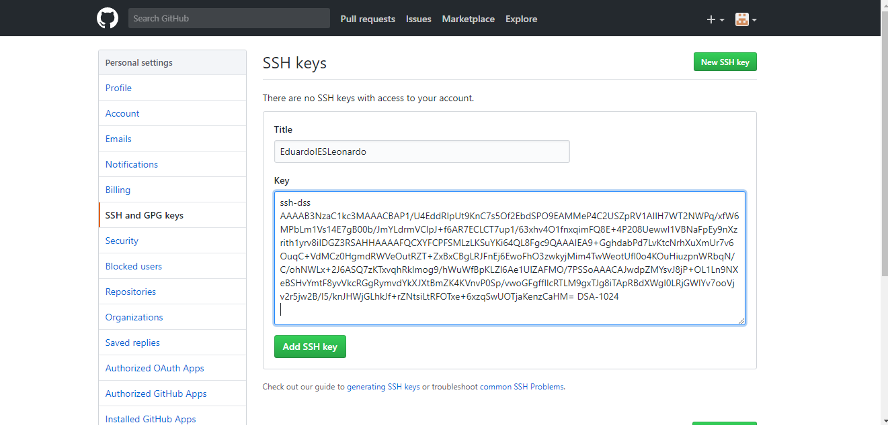

##### Parte 3. Clonación de un repositorio

Vamos a importar a nuestra máquina el repositorio que hemos creado. Ahora está vacío y no tiene mucho sentido importarlo, pero es la forma más fácil de asegurarse una correcta configuración local.  

1. En la web de GitHub accede a tu repositorio *dwesXX-github* y haz clic en *Clone or download*: verás que se te ofrece un identificador parecido a este para clonar con SSH, que deberás copiar: `git@github.com:tuperfil/dwesXX-github.git`
2. Abre en Eclipse la vista de repositorios Git con *Window → Show View → Other → Git → Git Repositories*
- Escoge *Clone Git Repository*. Puedes localizar el botón correspondiente a esta acción.
- Aunque se nos presenta una ventana con muchos campos, basta con pegar el identificador que copiamos antes en el campo *URI* y el resto se rellenará de forma automática.
- En el siguiente paso, el asistente nos sugerirá clonar la rama principal (*master*), que es la única que existe (no ha habido modificaciones). 
- En el siguiente paso se nos solicitará la carpeta en la que clonar el repositorio:será algo parecido a `C:\Users\usuario\git\dwesXX-github`
- Observa que hay una casilla para importar todos los proyectos del repositorio: en este punto no tiene sentido, pero cuando más adelante estés clonando el repositorio en un equipo y tengas ya proyectos en marcha, siempre la marcaremos.

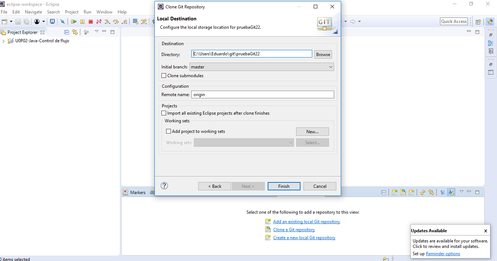

- Pulsa *Finalizar* y comprueba que el repositorio aparece en la vista de Repositorios de Git.
- Por último, comprueba que en tu equipo se ha creado la subcarpeta *dwesXX-github* en tu carpeta de repositorios Git, y que dentro aparece el archivo *README* con el texto que escribiste en la web

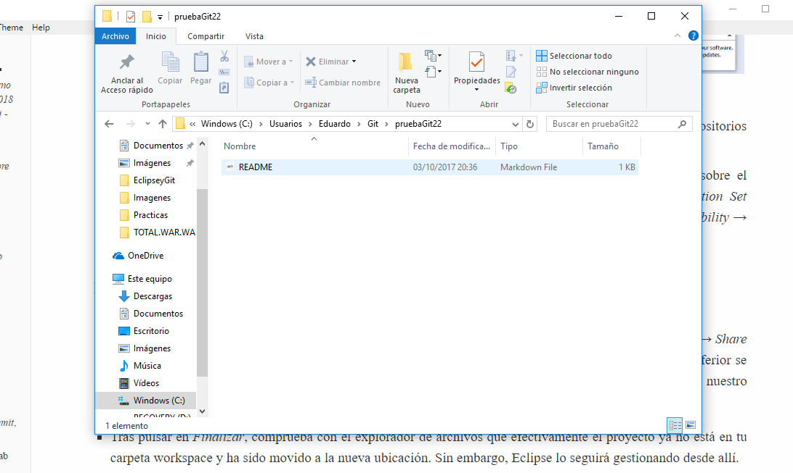

- Añade a Eclipse la barra de herramientas de Git: así tendrás acceso más rápido a las operaciones sobre el repositorio. Para ello accede a *Window → Perspective → Customize perspective*. En la pestaña *Action Set Availability tab* marca las opciones *Git* y *Git Navigation Actions*. Ahora accede a la pestaña *Tool bar visibility* → *Git* y podrás personalizar los botones que deseas mostrar (los imprescindibles son *Commit, Push, Fetch*).

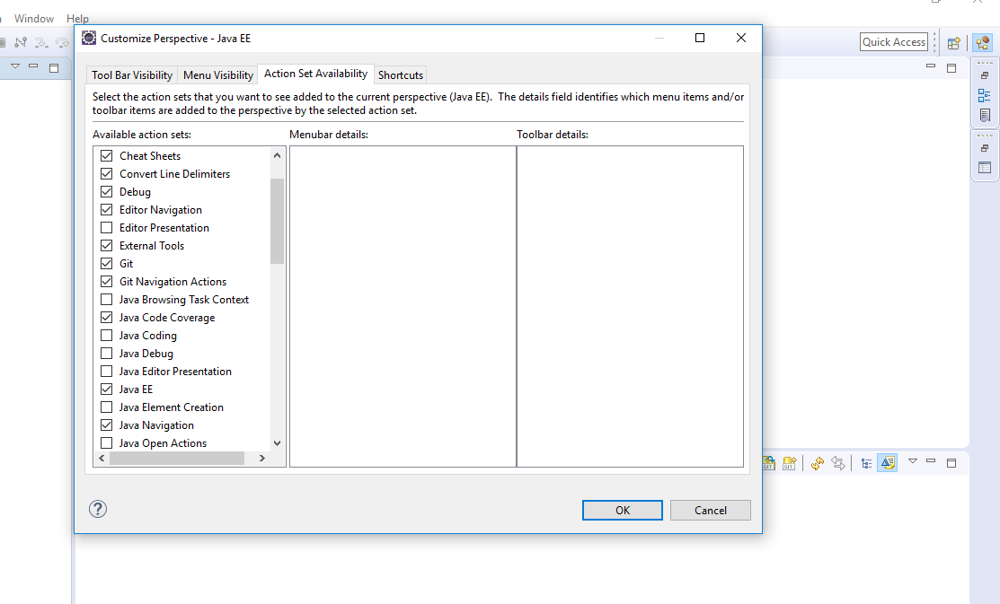

##### Parte 4. Inclusión de un proyecto en el repositorio

1. Escoge tu proyecto de prueba en Eclipse y compártelo con Git: *clic secundario sobre el proyecto → Team → Share Project*. En el desplegable escogeremos nuestro repositorio *dwesXX-github*. Observa que en la ventana inferior se indica lo que va a suceder: el proyecto se moverá desde nuestra carpeta *workspace* a la carpeta de nuestro repositorio.
- Tras pulsar en *Finalizar*, comprueba con el explorador de archivos que efectivamente el proyecto ya no está en tu carpeta workspace y ha sido movido a la nueva ubicación. Sin embargo, Eclipse lo seguirá gestionando desde allí.

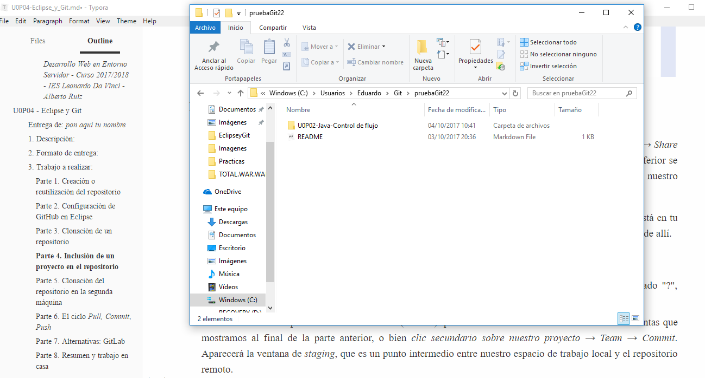

- Comprueba que en el explorador de proyectos de Eclipse aparece nuestro proyecto con iconos de estado "?", puesto que no se ha hecho aún ningún *Commit*. Aprende más sobre los diferentes iconos [en este enlace](http://wiki.eclipse.org/EGit/User_Guide#Icon_Decorations).
- Vamos a realizar la operación de confirmación (*commit*): puedes utilizar el icono de la barra de herramientas que mostramos al final de la parte anterior, o bien *clic secundario sobre nuestro proyecto → Team → Commit*. Aparecerá la ventana de *staging*, que es un punto intermedio entre nuestro espacio de trabajo local y el repositorio remoto.
- Arrastra todos los archivos de la ventana *unstaged changes* a la ventana *staged changes*, incluye un comentario (por ejemplo *"primera versión"*) y pulsa en *Commit*. Podrías hacer *Commit and push* pero en esta primera vez lo haremos por separado para mayor claridad.

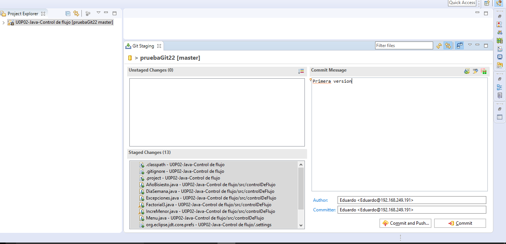

- Puedes comprobar en la web de GitHub que aún no aparece nuestro proyecto.
- En este punto podemos hacer *Push* para subir los cambios indicados (en este caso todos los archivos del proyecto) al repositorio remoto. Puedes utilizar el botón si tienes activa la barra de herramientas de Git, o *botón secundario sobre el proyecto → Team → Push to Upstream*.
- Comprueba que ahora sí aparece el proyecto en la web de GitHub. Observa que los archivos compilados no se suben al repositorio (investiga el archivo *.gitignore*)
- Localiza la opción en la web para descargar el proyecto como un archivo ZIP
- Localiza la opción en la web para añadir un usuario autorizado al proyecto. Recuerda que todos los usuarios podrán verlo, pero sólo los autorizados podrán modificarlo.

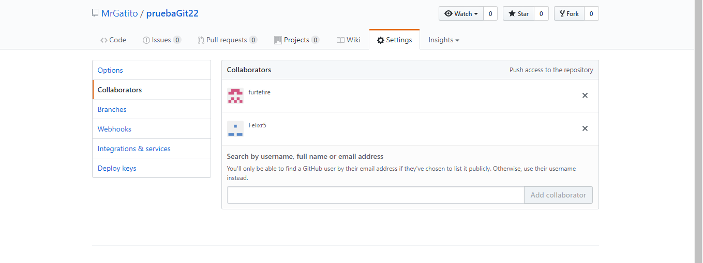

##### Parte 5. Clonación del repositorio en la segunda máquina

La principal ventaja que tiene Git para ti es que podrás desarrollar proyectos tanto en casa como en clase de forma cómoda. Para simular este proceso vamos a trabajar ahora con la máquina clonada.

1. Clona en esta máquina el repositorio remoto: para ello debes repetir los pasos de la parte 3.


1. Importa el proyecto del repositorio. Existen dos formas de hacer esto:
  * En la misma operación de clonación puedes marcar la casilla de *Importar proyectos existentes*
  * En el explorador de proyectos de Eclipse, *botón secundario → Import → Git → Projects from Git → Clone URI*, utilizando de nuevo el identificador de nuestro repositorio.


##### Parte 6. El ciclo *Pull, Commit*, *Push*

Existen multitud de guías sobre el flujo de trabajo en Git, [algunas de ellas muy sencillas](http://rogerdudler.github.io/git-guide/index.es.html). Nosotros vamos a trabajar de forma muy básica, siempre con la rama *master* y sin explorar las capacidades de trabajo en equipo de Git, que caen fuera del ámbito de este módulo profesional. Básicamente tus acciones cuando llegues a un equipo, ya sea el de casa o el de clase, serán:
1. Hacer *Pull* para incorporar en tus proyectos locales los cambios que se puedan haber incluido en la versión de tu proyecto que está en el repositorio.


1. Continuar desarrollando tus proyectos en la máquina
2. Cuando termines tu sesión de trabajo, hacer *Commit y Push* de los archivos cuyos cambios des por válidos para subirlos al repositorio remoto

```
Lo he hecho correctamente.
```


A continuación haremos una prueba básica de este ciclo.

1. Realiza la operación *Pull*: no se detectarán cambios porque aún no los hay.

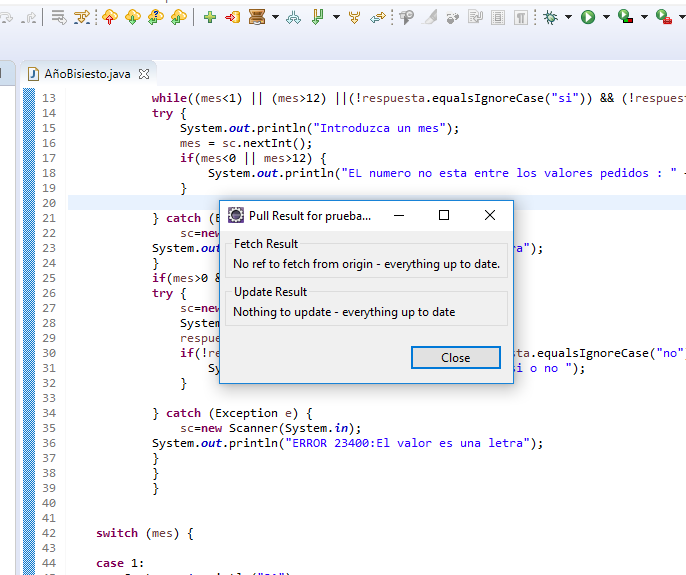

1. Modifica el código fuente de tu proyecto (por ejemplo añade código para escribir en pantalla la máquina con la que estás trabajando ahora)
2. Inicia el proceso de confirmación de los cambios o *Commit* y arrastra el archivo modificado de *unstaged* a *staged changes*. Añade un mensaje para el Commit, por ejemplo *"nuevo mensaje escrito en pantalla"*

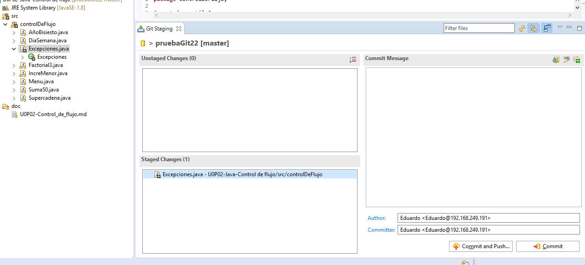

1. Pulsa en *Commit and Push* o bien realiza ambas acciones por separado.
2. Comprueba en la web de GitHub que el archivo ha sido actualizado
  Ahora imaginemos que desde casa has realizado algunos cambios en el proyecto. Para simular esto, accede a la web de GitHub y, desde allí, modifica manualmente dos archivos: uno de código fuente y otro de Markdown. Observa que en GitHub sólo hace falta la operación *Commit*: no tiene sentido *Push* puesto que estás manipulando el repositorio original.

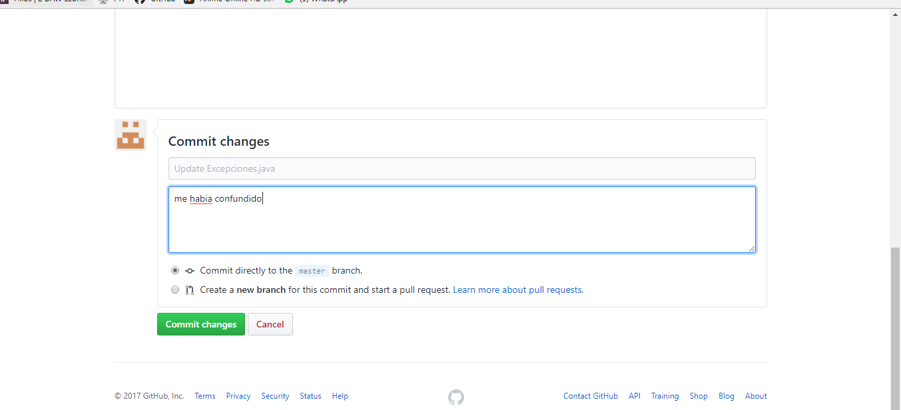

Siguiendo con nuestro escenario, volvemos a clase al día siguiente:

1. Realiza la operación *Pull*, y verás cómo se incorporan los cambios. Tu proyecto está ahora actualizado.
2. Accede al histórico de cambios: *clic secundario sobre el proyecto → Team → Show in History* y examina los resultados.

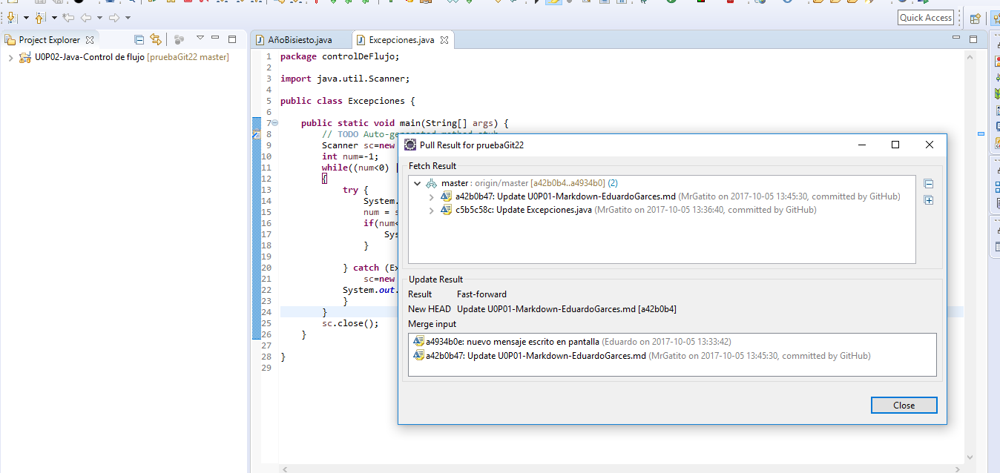

**Nota importante: detección de errores**

Presta atención a estas operaciones, de lo contrario puedes tener que lidiar con molestos problemas con el repositorio, que finalmente suelen terminar forzando la eliminación del mismo y el reinicio mediante la clonación. Para detectar problemas, observa el texto marrón que aparece junto a tus proyectos Eclipse: debería mostrar algo como esto: `[dwesXX-github master]`. Sin embargo, si al final aparecen símbolos como  `↑1` indica que hay 1 o más versiones de tus proyectos que se han intentado  subir al repositorio sin éxito, habitualmente por problemas de conexión. Si aparecen símbolos como `↓1` significa que hemos descargado cambios del repositorio (operación *fetch*) pero no los hemos incorporado a la rama principal (*pull*).

##### Parte 7. Alternativas: GitLab

Aunque GitHub es la opción preferida de los desarrolladores, presenta el problema de no ofrecer de forma gratuita repositorios privados. Existen otras opciones muy utilizadas como [GitBucket](https://bitbucket.org/) o GitLab. Estudiaremos esta última por dos motivos: es de código abierto y ofrece actualmente mayor espacio para nuestros proyectos (10 GB).

El objetivo de esta parte es que comprendas que el plugin de Git para Eclipse es genérico, y que el funcionamiento de las diferentes implementaciones de Git es el mismo. Existen diferencias anecdóticas de nombrado entre algunas funcionalidades: quizá la más relevante es que el repositorio de GitHub se llama proyecto en GitLab.

1. Accede a [la web de GitLab](https://gitlab.com/)
2. Crea una nueva cuenta, a ser posible utilizando el mismo nombre de usuario que en GitHub para evitar confusiones
  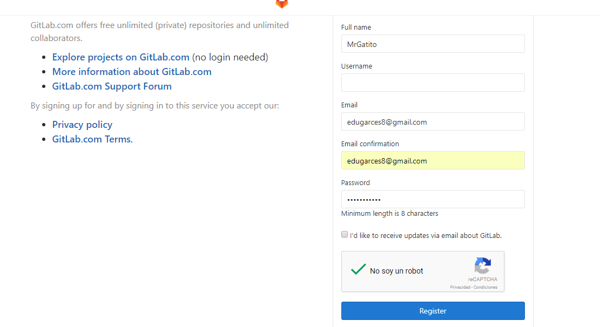
3. Una vez creada la cuenta, crea un nuevo repositorio privado llamado  **dwesXX-gitlab** donde XX sea tu número de equipo.
  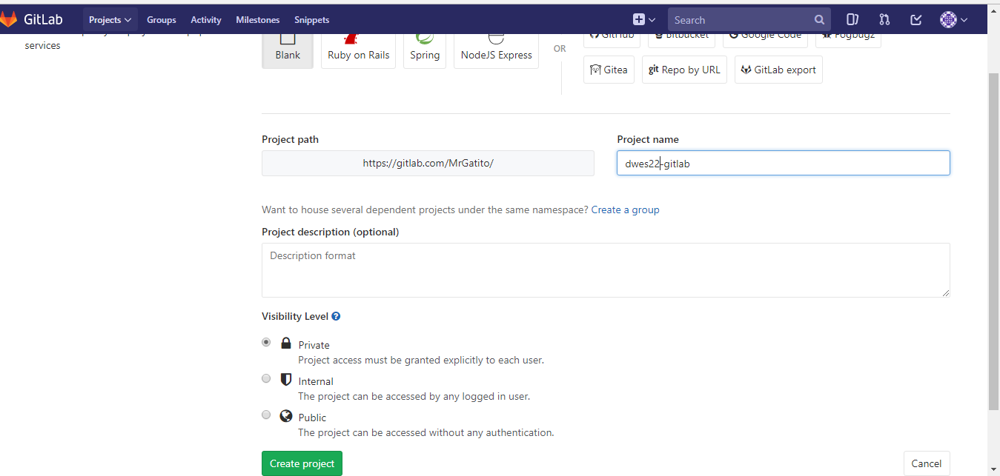
4. Crea un nuevo archivo *README* y comprueba que GitLab también utiliza MarkDown como lenguaje de documentación y permite la edición y previsualización de documentos.
  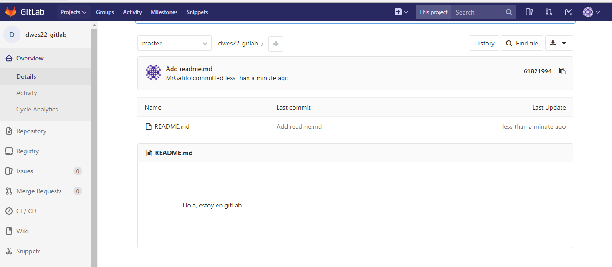
5. En Eclipse, carga (Load) la clave SSH que generamos y almacenamos en la carpeta de repositorios: no crees una nueva. Vamos a reutilizar la misma para comunicarnos con GitLab. Cópiala al portapapeles
```
git@github.com:MrGatito/pruebaGit22.git
```


1. Localiza ahora en la web la sección para añadir una clave SSH y añádela
  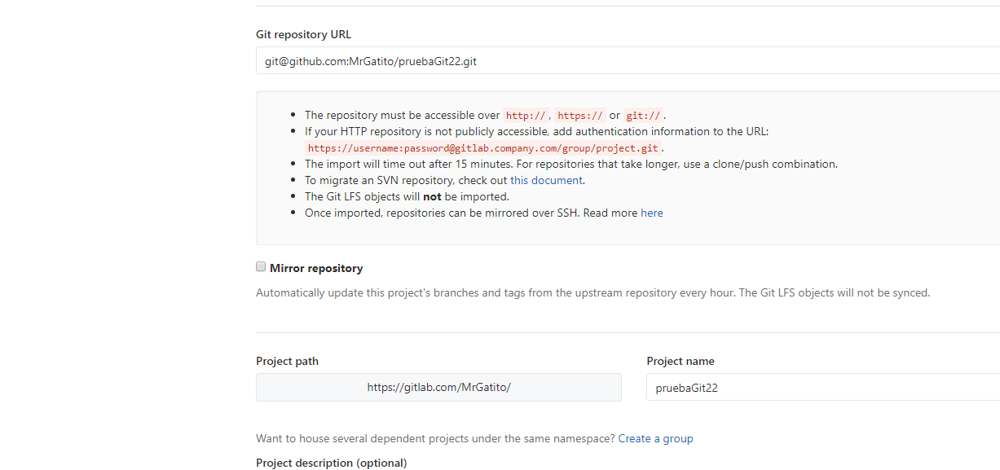
2. Ahora localiza en la web el identificador que nos permitirá clonar el repositorio por SSH


1. Desde la vista de Git Repositories de Eclipse, clona el repositorio introduciendo el identificador en el campo URI del asistente. Escoge protocolo "SSH"
  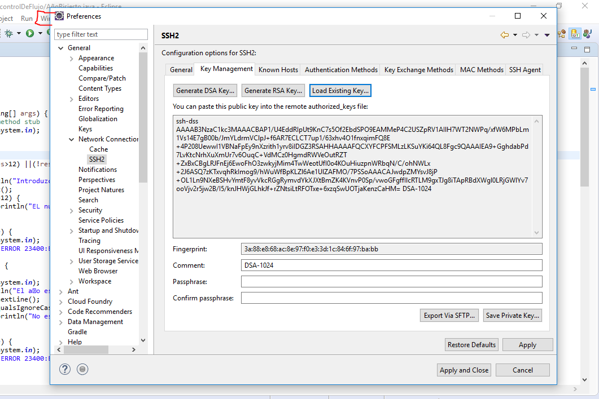

2. Observa que ahora conviven en Eclipse dos repositorios de dos proveedores diferentes, sin que el uno interfiera en el otro (siempre que los proyectos que haya en uno y otro sean diferentes)

3. Crea un nuevo proyecto Java de prueba y realiza el proceso para subirlo al repositorio GitLab:

  * Compartir el proyecto (Share project)

    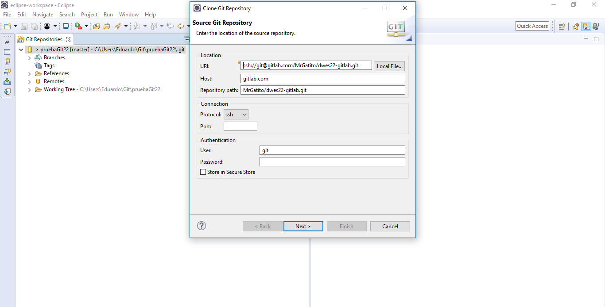

  * Commit (seleccionar todos los archivos y arrastrarlos a *staged changes*)

  * Push

  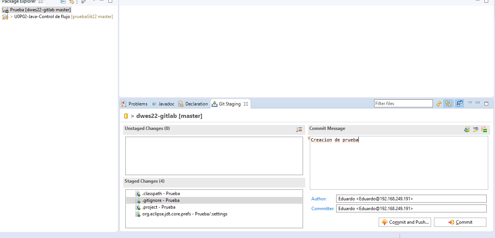

4. Comprueba que ha aparecido en la web
  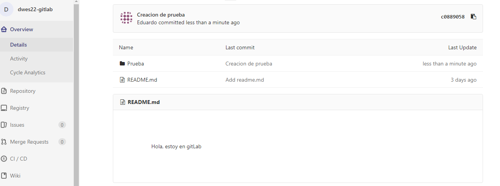

5. Localiza la opción en la web de GitLab para descargar el proyecto como un archivo ZIP
6. Localiza la opción en la web de GitLab para añadir un miembro autorizado a nuestro proyecto
7. ¿Observas alguna diferencia de funcionamiento entre los proyectos de GitHub y GitLab?
```
Ninguna, la verdad.
```


##### Parte 8. Resumen y trabajo en casa

Para trabajar con Git en una máquina nueva tenemos que hacer lo siguiente:

```
Esto no lo hago porque lo estoy haciendo con el pc de casa.
```


1. Instalar el plugin de Git en Eclipse. Se recomienda activar también la barra de herramientas de Git.

2. Generar una clave SSH y añadirla en la web de GitHub o GitLab

3. Clonar el repositorio remoto desde la vista de Repositorios de Git

4. Importar el/los proyecto/s deseados

5. Comenzar el ciclo de trabajo, que siempre será *Pull, sesión de trabajo, Commit, Push*:

   ​
